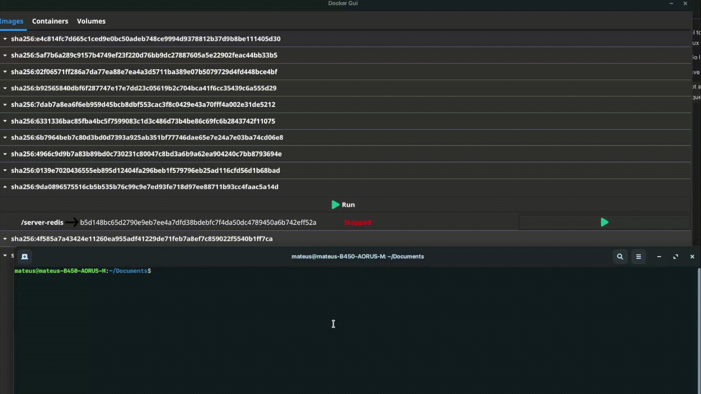

# Binocular

This project has the goal to create a GUI for visualizing Docker Containers, Images and Volumes, and also monitor
the resources being used by Docker containers, focusing primarily in Linux based operating systems. 

The project is made in Go language with the use of the [Fyne](https://fyne.io/) user interface toolkit.

It is required that you have [Go](https://go.dev/doc/install) and [Docker](https://docs.docker.com/engine/install/ubuntu/) installed in your machine.

> Disclaimer: This is not a project with commercial porpuses and it is done in the author's free time. Feel free to fork the project to implement other features and commit a pull request if you want to.

## Planned future work
* Refactor and organize current work according to design patterns
* Run images and create a new docker container item 
* List Volumes
* Show Memory used by containers in a chart
